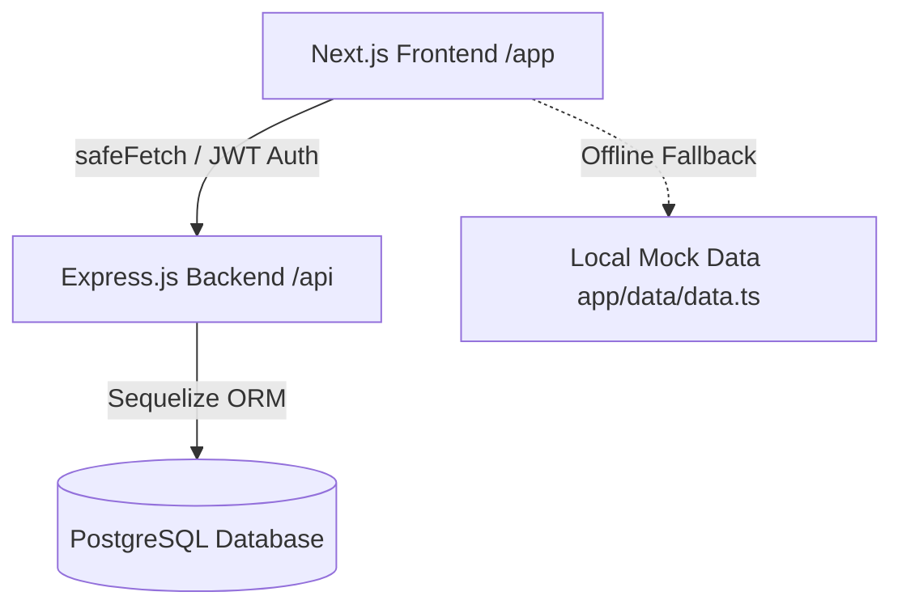
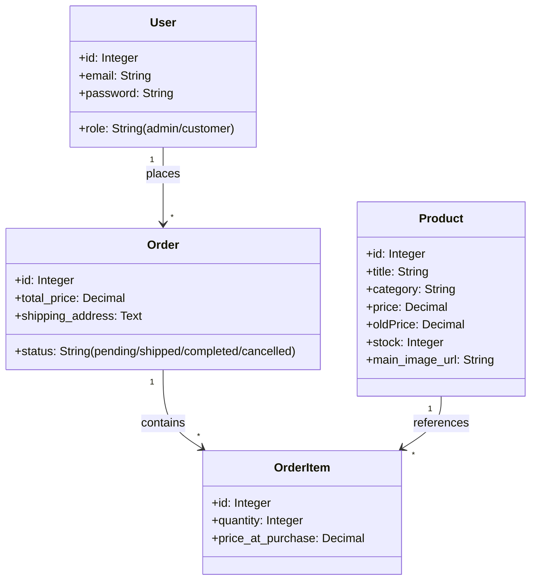

# Griva Web Platform Integration & Admin Dashboard Handoff Document

This document provides a highly detailed engineering handoff for the Griva E-Commerce and Admin Dashboard project. It is structured to allow another AI developer or system engineer to understand the current implementation, run the application, configure cloud integrations, and proceed with feature development.

---

## 1. System Architecture & Tech Stack

Griva uses a decoupled client-server architecture:



### Technical Stack Components
*   **Frontend**: Next.js 13+ App Router (TypeScript, TailwindCSS, Lucide React). Run port: `3000`.
*   **Backend**: Node.js & Express REST API (Sequelize ORM). Run port: `5000`.
*   **Database**: PostgreSQL (with support for production SSL handshakes).
*   **Asset Storage**: Recommended Cloudflare R2 or AWS S3.

---

## 2. Directory Layout & Key Modules

```text
griva-web/
├── backend/
│   ├── src/
│   │   ├── config/
│   │   │   ├── db.js             # Database setup & production SSL config
│   │   │   └── seed.js           # Schema generation & analytical mocks seeder
│   │   ├── controllers/
│   │   │   ├── orderController.js # Analytics & order transition logic
│   │   │   └── authController.js  # JWT auth checks
│   │   ├── models/
│   │   │   ├── User.js           # User roles (admin/customer)
│   │   │   ├── Product.js        # Catalog item details
│   │   │   ├── Order.js          # Order records
│   │   │   ├── OrderItem.js      # Individual line items mapping
│   │   │   └── Subscriber.js     # Newsletter emails
│   │   └── routes/
│   │       ├── orderRoutes.js    # Routes for orders & analytics
│   │       └── app.js            # Express app entry
│   └── .env.example              # Template environment configurations
└── frontend/
    ├── app/
    │   ├── admin/
    │   │   ├── components/
    │   │   │   ├── OverviewTab.tsx # Dashboard, stats, SVG charts, schema map
    │   │   │   ├── OrdersTab.tsx   # Order statuses, dropdowns, details
    │   │   │   └── ProductsTab.tsx # Catalog tables & stock levels
    │   │   ├── login/
    │   │   │   └── page.tsx        # JWT Login with local fallback
    │   │   └── page.tsx            # Main dashboard manager
    │   └── utils/
    │       └── api.ts              # API safeFetch wrapper & async helpers
```

---

## 3. Database Schema Design (Sequelize Models)

The PostgreSQL database is organized into the following model associations:



---

## 4. API Endpoints Reference

### Admin Authentication
*   **`POST /api/auth/login`**
    *   **Body**: `{ "email": "admin@griva.qa", "password": "AdminPassword123!" }`
    *   **Response**: `{ "token": "JWT_TOKEN_HERE", "user": { "id": 1, "email": "admin@griva.qa", "role": "admin" } }`

### Order & Analytics Management
*   **`GET /api/orders/analytics`**
    *   **Headers**: `Authorization: Bearer <JWT_TOKEN>`
    *   **Response**:
        ```json
        {
          "totalSales": 12450.75,
          "totalOrders": 42,
          "averageOrderValue": 296.44,
          "totalCustomers": 18,
          "orderStatusCounts": { "pending": 5, "shipped": 12, "completed": 20, "cancelled": 5 },
          "salesOverTime": [
            { "date": "Jun 01", "sales": 450.00 },
            { "date": "Jun 02", "sales": 1200.50 }
          ],
          "salesByCategory": [
            { "category": "Gadgets", "sales": 5400.00 },
            { "category": "Laptops", "sales": 7050.75 }
          ]
        }
        ```
*   **`GET /api/orders`**
    *   **Headers**: `Authorization: Bearer <JWT_TOKEN>`
    *   **Response**: Array of order objects with eager-loaded `user` details and `items` lists containing `product` structures.
*   **`PUT /api/orders/:id/status`**
    *   **Headers**: `Authorization: Bearer <JWT_TOKEN>`
    *   **Body**: `{ "status": "shipped" }` (Accepts: `pending`, `shipped`, `completed`, `cancelled`)
    *   **Response**: `{ "success": true, "order": { "id": 1, "status": "shipped" } }`

---

## 5. UI Components Details

### A. Login Access (`frontend/app/admin/login/page.tsx`)
*   Performs database-connected sign-ins.
*   Saves token to local storage.
*   **Fallback Strategy**: If backend connection fails, permits entry using credentials `admin@griva.qa` / `AdminPassword123!` to enable UI testing.

### B. Overview Dashboard (`frontend/app/admin/components/OverviewTab.tsx`)
*   **KPI Tiles**: Displays Revenue, Order Volume, AOV, and Customers with loading animations.
*   **SVG Charts**: Custom inline SVG widgets for Sales Line Charts and Category Pie Charts. Keeps load times low without heavy npm dependencies.
*   **Campaign Switches**: Direct dashboard hooks for Store Top-bar announcement, Friday sales promotions, and Midnight flash sales.
*   **Storefront Layout Schema**: Interactive mockup showing the mapping between storefront layout sections and backend-controlled options.

### C. Orders Control Panel (`frontend/app/admin/components/OrdersTab.tsx`)
*   **Lifecycle Management**: Dynamically displays buttons to move orders along allowed status workflows:
    *   `pending` ➔ `shipped` or `cancelled`
    *   `shipped` ➔ `completed` or `cancelled`
*   **Details Viewer**: Collapsible row component displaying shipping address details and specific catalog product selections.

---

## 6. How to Configure & Deploy on Cloud Hosting

### A. Production Database Setup (Azure / AWS)
Cloud databases require TLS/SSL connections. Configure SSL handshakes inside `backend/src/config/db.js`:

1.  Download the SSL certificate (e.g., Baltimore CyberTrust Root / DigiCert Global Root G2 certificate) from your database provider.
2.  Reference the certificate file path and adjust DB initialization configurations:
    ```javascript
    const sequelize = new Sequelize(process.env.DATABASE_URL, {
      dialect: 'postgres',
      dialectOptions: {
        ssl: {
          require: true,
          rejectUnauthorized: true,
          ca: fs.readFileSync(path.join(__dirname, 'DigiCertGlobalRootG2.crt.pem'))
        }
      }
    });
    ```
3.  Ensure `NODE_ENV=production` is set in production environment variables so the SSL properties are applied.

### B. Cloud Asset Storage (Cloudflare R2 / AWS S3)
To enable product image uploads:

1.  Add S3 SDK dependencies to your backend:
    ```bash
    cd backend
    npm install @aws-sdk/client-s3 @aws-sdk/s3-request-presigner
    ```
2.  Provide the bucket credentials in backend environment variables:
    ```env
    AWS_ACCESS_KEY_ID=your_access_key
    AWS_SECRET_ACCESS_KEY=your_secret_key
    AWS_REGION=us-east-1
    AWS_BUCKET_NAME=griva-catalog-assets
    # Required for Cloudflare R2 endpoint redirection:
    AWS_ENDPOINT_URL_S3=https://<account_id>.r2.cloudflarestorage.com
    ```
3.  Implement a `POST /api/upload` endpoint to issue signed upload URLs for the frontend client.

---

## 7. Roadmap & Future Work

1.  **Frontend Image Upload Hookup**: Update the product registration modal in `ProductsTab.tsx` to handle file selection and perform direct cloud asset upload.
2.  **Slides & Banners Database Sync**: Migrate the homepage slider structures into the database and configure endpoints to manage banner edits from the CMS tab.
3.  **Client Checkout Connection**: Route storefront checkout actions to `POST /api/orders` to save client orders and update product inventory.
